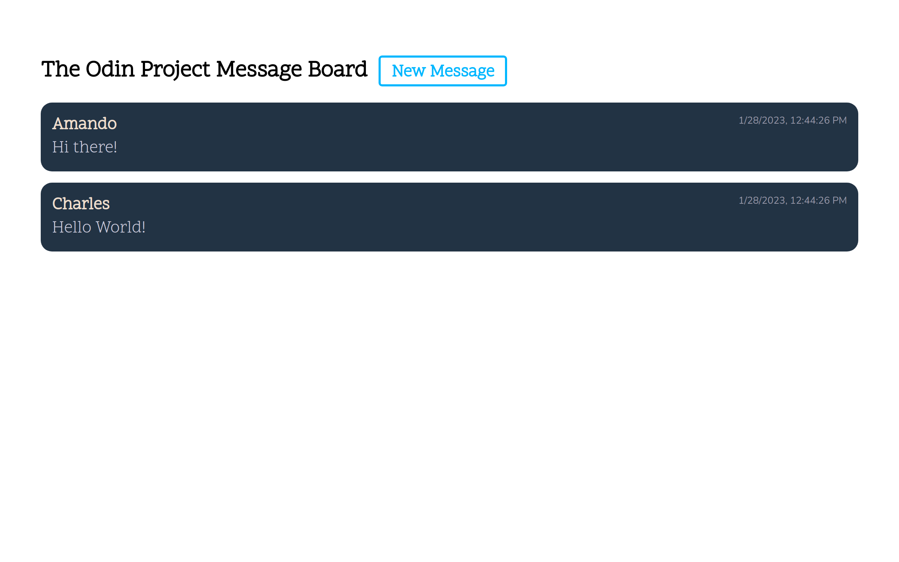
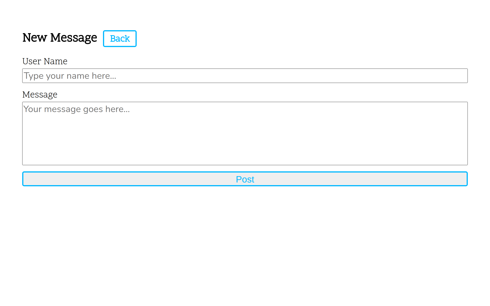
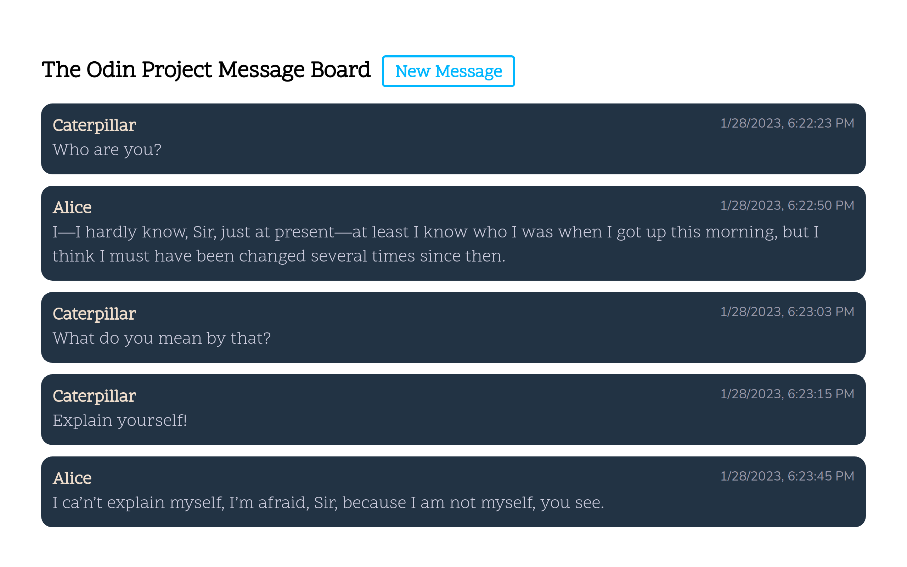

# Message Board Project

This assignment was to write a simple message board site using Node, Express, and a view engine. I chose the PUG view engine, as that is what TOP previously used.

There is no back-end database attached in this project. That was by design, so when the project is restarted, all the messages are periodically wiped. The highest rated projects definitely had issues with crass comments being posted.

## Initial State

When the website is loaded, two messages are pre-populated, as per instruction.

## New Message

By clicking on the link to create a new message, a second view is displayed. This view contains a form and two input items with a submit button.

## After Submission

Miss Trunchbull from _Matilda_ has gotten on the site and has left a sour comment for us...

